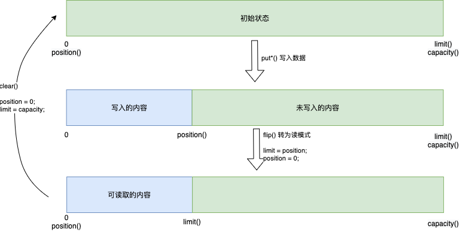

# Buffer

Buffer 用于和 NIO Channel 进行交互，数据是从通道读入缓冲区，从缓冲区写入到通道中的。

缓冲区本质上是一块可以读写数据的内存。这块内存被包装成 NIO Buffer 对象，并提供了一组方法，用来方便的访问该块内存。

## 核心概念

- `position`：表示当前位置的指针
  - 初始值为 0，最大可为 Buffer 的大小 
  - 写数据时，每次写，position 会向后移
  - 从写模式 切换到 读模式时，position 会被重置为 0，每次读，position 会向后移

- `limit`
  
  - 初始模式下 limit = capacity
  - 写模式下 limit = capacity
  - 切换读模式时，limit = position，position 重置为 0，limit 表示可以读数据的结束位置
  
  
  
- `capacity`：Buffer 的固定大小值

- `0 <= position <= limit <= capacity`

## 常用方法

- `flip()` 写模式切换到读模式，limit = position，position 重置为 0
- `rewind()` position 重置为 0，与`flip()` 的区别是 limit 不变，只重置 position，这样可以重新读

- `mark()` 标记 position 的位置
- `reset()` 恢复 position 位置

- `clear()` 清空整个 Buffer，position=0 置为0、limit = capacity 为可写入的数据大小
- `compact()` 只会清除已经读过的数据。任何未读的数据都被移到缓冲区的起始处，新写入的数据将放到缓冲区未读数据的后面。

- `slice()` 创建 `[position,limit)` 之间的子 Buffer，父子共享数据

## Read More

- [NIO Example](https://github.com/hello-world-example/Java-IO/tree/master/demo-java-nio/src/main/java/xyz/kail/demo/java/io)
- 
- [NIO相关基础篇 一](https://mp.weixin.qq.com/s/jeuISFEh49aUheFsX_aHMg)

