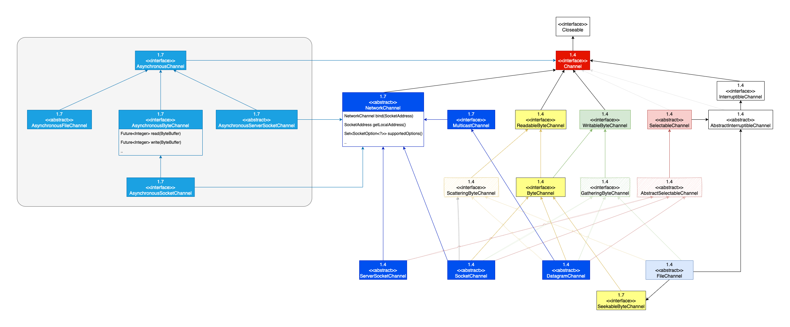

# Channel

- 标准的 IO 基于 **字节流 和 字符流** 进行操作，而 NIO 是基于 **通道（Channel）和 缓冲区（Buffer）** 进行操作

## FileChannel

### FileLock

> - `lock()` 阻塞，锁定范围可以随着文件的增大而增加，默认为独占锁；
> - `tryLock()` 非阻塞，当未获得锁时，返回 `null`

| 方法                                                         | 说明                                  |
| :----------------------------------------------------------- | :------------------------------------ |
| `lock()`                                                     | 整个文件的独占锁定                    |
| `lock(long position,long size,boolean shared)`               | 文件指定区域上的锁定，共享锁          |
| `tryLock() throws IOException`                               | 试图获取 整个文件的独占锁定           |
| `tryLock(long position,long size,boolean shared) throws IOException` | 试图获取 文件指定区域上的锁定，共享锁 |
| `release()`                                                  | 释放锁                                |
| `close()` =>  `try (final FileLock lock = fileChannel.lock()) { ... }` | 释放锁                                |

## Read More

- [NIO Example](https://github.com/hello-world-example/Java-IO/tree/master/demo-java-nio/src/main/java/xyz/kail/demo/java/io)

- [NIO相关基础篇 一](https://mp.weixin.qq.com/s/jeuISFEh49aUheFsX_aHMg)
- [NIO相关基础篇二](https://mp.weixin.qq.com/s/KN7ANdJBLidlKBs6fGCutQ)