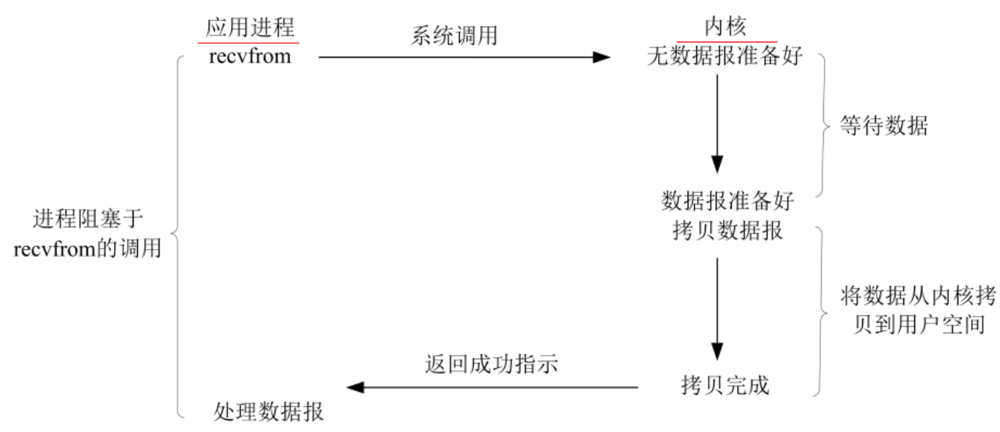
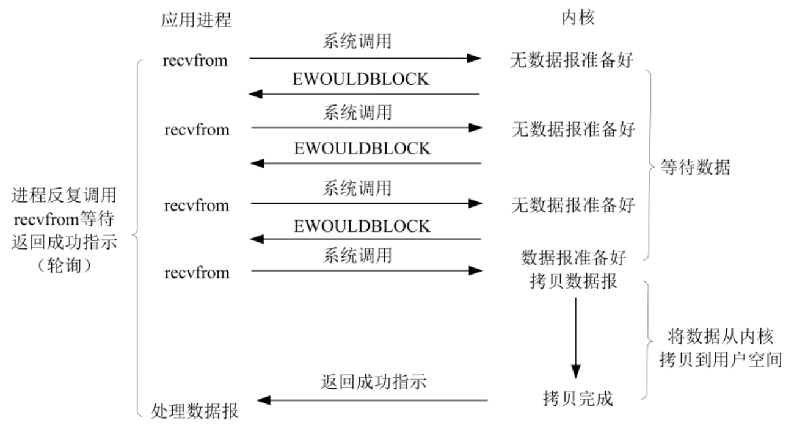
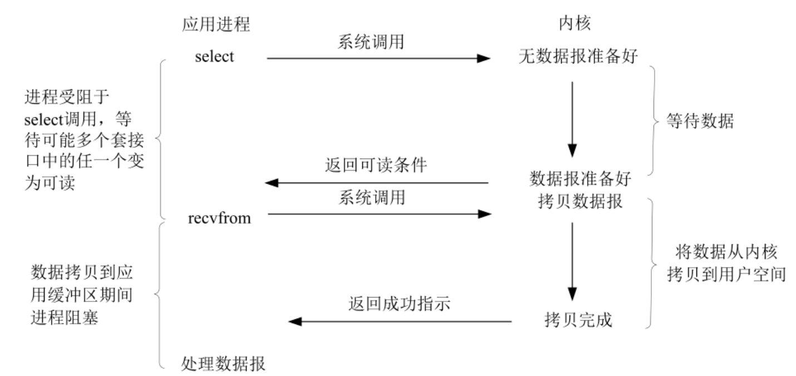
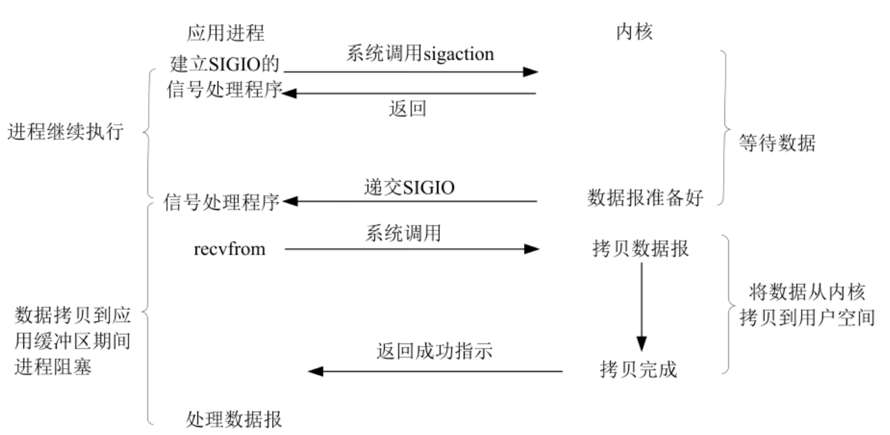
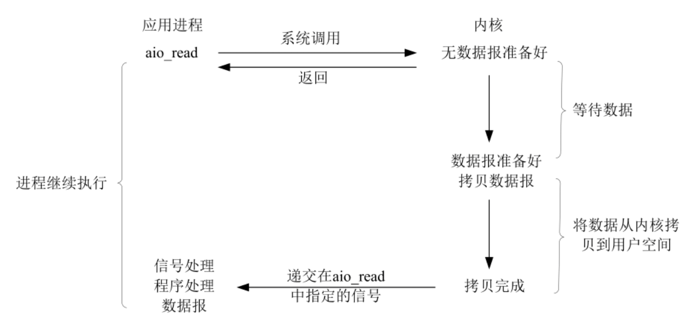
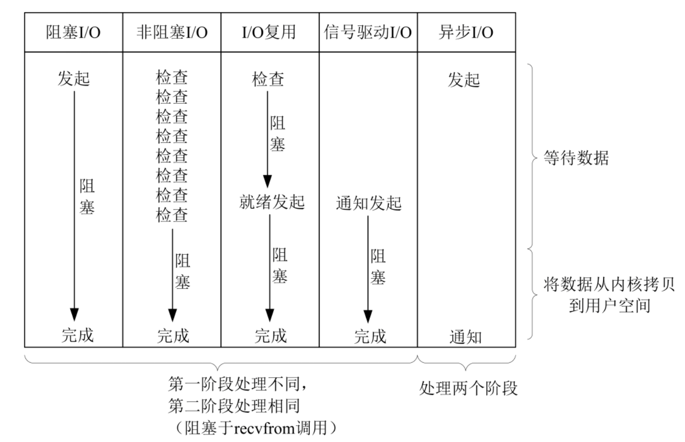
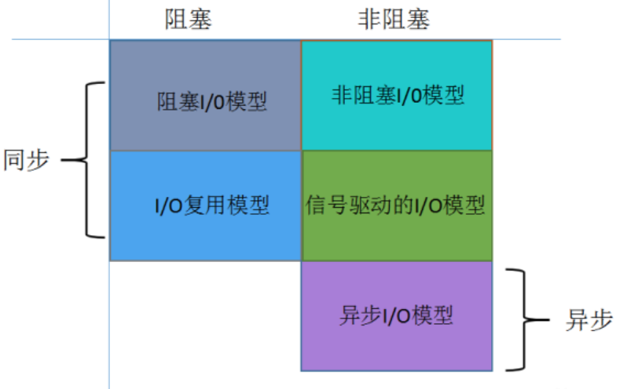

# 5 种 IO 模型


## IO 执行的两个阶段

操作系统为了安全性等的考虑，**进程是无法直接操作 I/O 设备的**，其必须**通过系统调用**请求**内核来协助完成 I/O 动作**。

- 等待数据准备好到达内核 Buffer
- 从内核向进程复制数据

```txt
|——————————————|  >>>>>>>>>  |--------------| >>>>>>>>>  |--------------|
|    Process   |             |    Kernel    |            |  I/O Device  |
|--------------|  <<<<<<<<<  |--------------| <<<<<<<<<  |--------------|
            (内核 Buffer 到进程空间)         (I/O 设备到内核 Buffer)
```

I/O 设备数据到 内核， 内核 到 进程用户空间，这两段时间内**等待方式的不同**，I/O动作可以分为**五种模式**。


## 1. (同步)阻塞I/O (Blocking I/O)




- **在 IO 执行的两个阶段中，进程都处于 blocked(阻塞) 状态**，在等待数据返回的过程中不能做其他的工作，只能阻塞的等在那里
- 优点：简单，实时性高，响应及时无延时
- 缺点：需要阻塞等待，性能差


## 2. (同步)非阻塞I/O (Non-Blocking I/O)



- 与阻塞式 I/O 不同的是，非阻塞系统调用调用之后，**进程并没有被阻塞，内核马上返回给进程一个状态**
- 采用**轮询的方式检查内核数据，直到数据准备好**，再拷贝数据到进程，进行数据处理
- 优点：**能够在等待任务完成的时间里干其他活**
- 缺点：任务完成的响应**延迟增大**，导致整体**数据吞吐量的降低**


## 3. I/O 复用（I/O Multiplexing: select、poll、epoll)



- 单个进程就可以同时处理多个网络连接的 IO
- 基本原理就是**不再由应用程序自己监视连接**，取而代之由**内核替应用程序监视文件描述符**，当任何一个 Socket 中的数据准备好了，用户进程再调用 Read 操作，将数据从内核拷贝到用户进程
- IO 复用的**优势并不是对于单个连接能处理得更快，而是单个进程就可以同时处理多个网络连接的 IO**
- 如果处理的**连接数不是很高的话**，使用 IO复用的服务器 **并不一定比使用 多线程+非阻塞 阻塞 IO的性能更好**，可能延迟还更大
- **优势：** 与传统的多线程/多进程模型比，**I/O多路复用的最大优势是系统开销小**，系统不需要创建新的额外进程或者线程，也不需要维护这些进程和线程的运行，**降底了系统的维护工作量，节省了系统资源**


## 4. 信号驱动的I/O (Signal Driven I/O)



- 允许注册一个信号处理函数，**进程继续运行并不阻塞**
- 当数据准备好时，进程会收到一个 SIGIO 信号，可以在信号处理函数中调用 I/O 操作函数处理数据
- 与 I/O 复用对
  - 区别：数据就绪**信号的接收是异步回调**，而 I/O 复用 的 **select 调用是同步等待**
  - 相同：**内核到用户空间的数据拷贝 都是同步的**


## 5. 异步I/O (Asynchrnous I/O) 




- 上述四种 IO 模型都是同步的，因为**数据从内核到进程空间拷贝都是同步调用**
- **等到数据准备好了，内核直接复制数据到进程空间**，然后从内核向进程发送通知，此时数据已经在用户空间了


## 对比







## Read More

- [[原文] Linux 五种 IO 模型](https://blog.csdn.net/z_ryan/article/details/80873449)
- [NIO相关基础篇三](https://mp.weixin.qq.com/s/5SKgdkC0kaHN495psLd3Tg)

