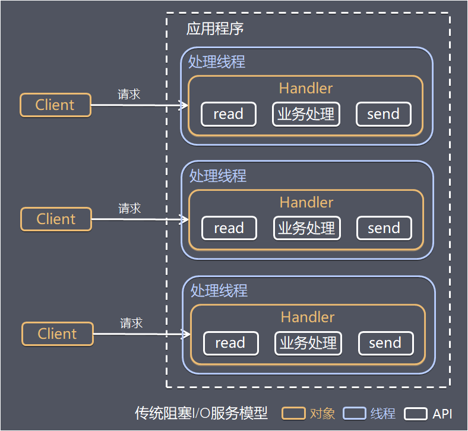
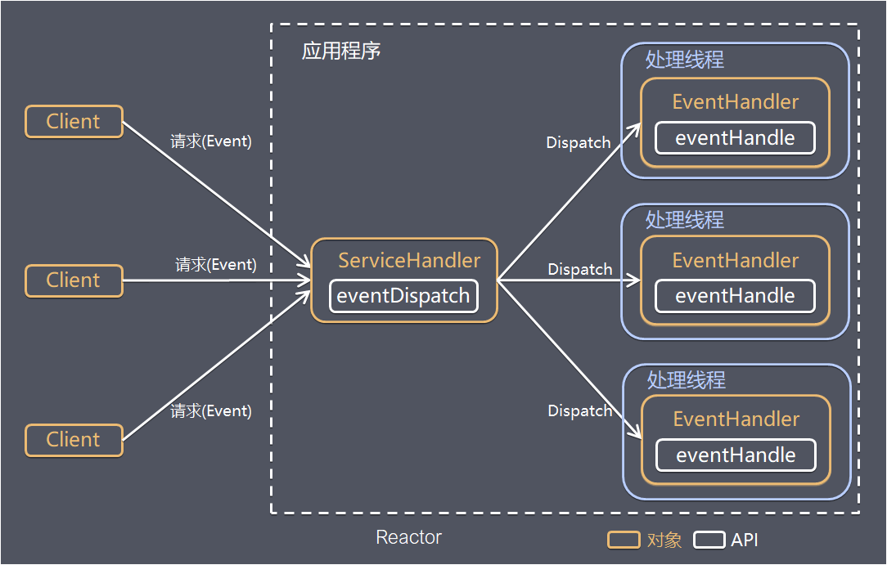
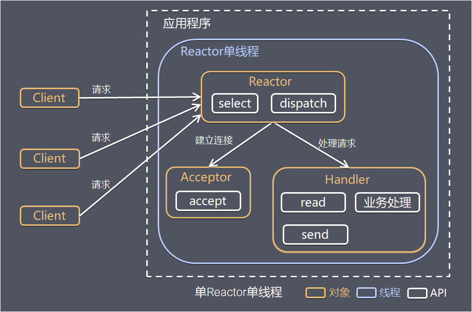
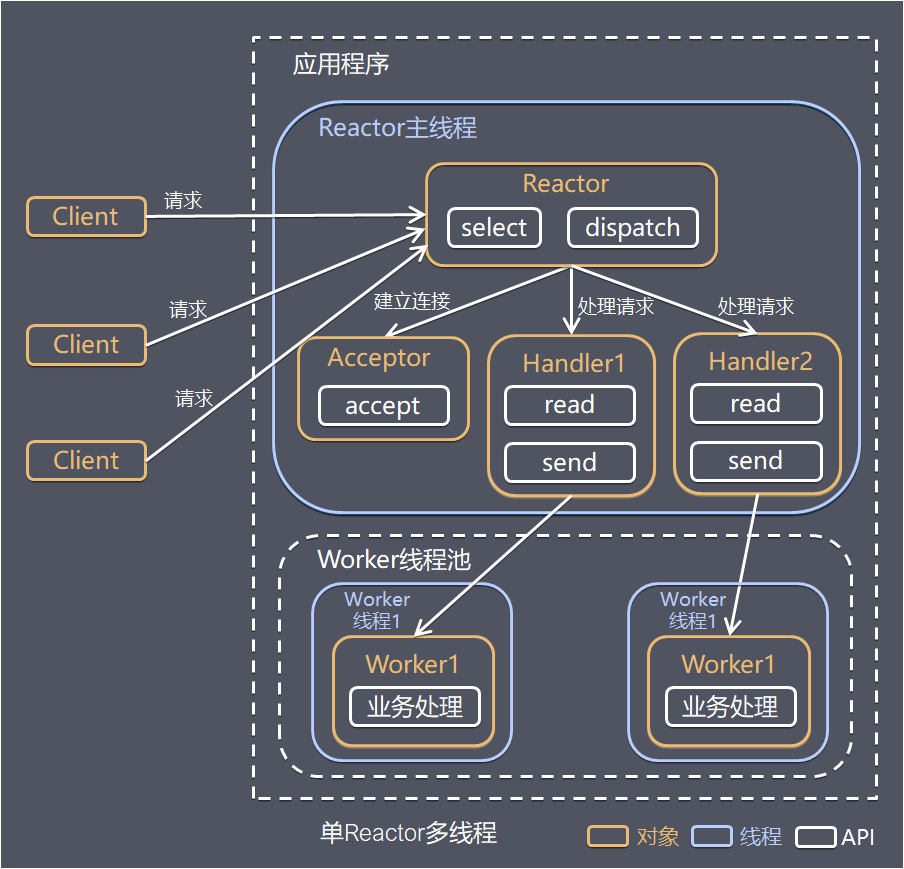
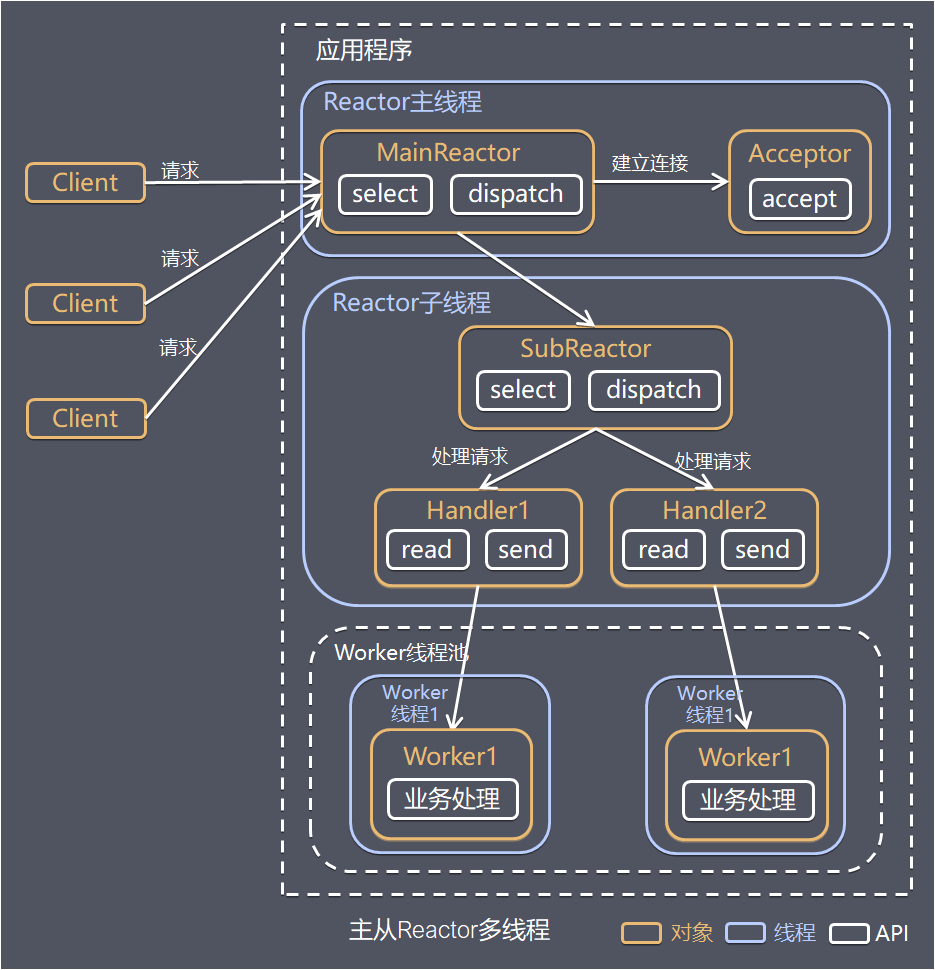
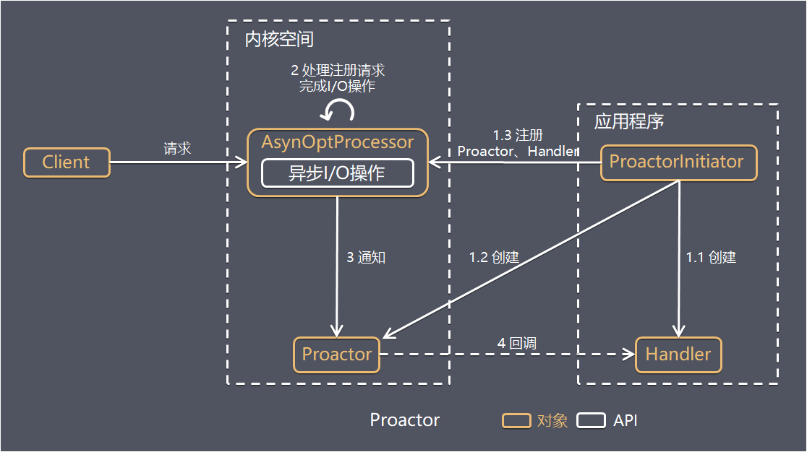

# Reactor 和 Proactor 模型

> 本文来自：[理解高性能网络模型](https://www.jianshu.com/p/2965fca6bb8f)

## 阻塞 I/O 模型

- **特点**
  - **每个连接都需要独立的线程** 完成数据输入、业务处理、数据返回
- **存在问题**
  - 当并发数较大时，需要创建大量线程来处理连接，系统资源占用较大
  - 连接建立后，如果当前线程暂时没有数据可读，则线程就阻塞在 read 操作上，造成线程资源浪费

## Reactor 模型

- Reactor 翻译过来的意思是 **反应堆**，即对事件反应
- Reactor 模式也叫 **Dispatcher 模式**，即 I/O 多路复用监听事件，**收到事件后根据事件类型分配（Dispatch）给某个线程**
- **I/O复用 + 线程池**，这就是 Reactor 模式基本设计思想

- Reactor 模式主要由 **Reactor** 和 **处理资源池** 这两个核心部分组成：
  - **Reactor** 负责监听和分发事件，事件类型包含连接事件、读写事件；
  - **处理资源池** 负责处理事件，如 read -> 业务逻辑 -> send；

- 根据 **Reactor 数量** 和 **处理资源池线程的数量** 不同，有 3种 典型的实现：
  - 单Reactor ↔ 单线程
  - 单Reactor ↔ 多线程
  - 多Reactor ↔ 多线程

### 单Reactor ↔ 单线程

- **优点**
  - 模型简单，没有多线程、进程通信、竞争的问题，全部都在一个线程中完成
- **缺点**
  - 只有一个线程，无法完全发挥多核 CPU 的性能
  - Handler 在处理某个连接上的业务时，整个进程无法处理其他连接事件，很容易导致性能瓶颈
- **场景**
  - 客户端的数量有限，业务处理非常快速，比如 Redis

### 单Reactor ↔ 多线程

- **优点**
  - 可以充分利用多核 CPU 的处理能力
- **缺点**
  - 多线程数据共享和访问比较复杂
  - Reactor 承担所有事件的监听和响应，高并发场景下容易成为性能瓶颈

### 多Reactor ↔ 多线程

 

- **说明**
  - Reactor 主线程 MainReactor 对象监听连接事件，收到事件后通过 Acceptor 接收，处理建立连接事件
  - Accepto 处理建立连接事件后，MainReactor 将连接分配 Reactor子线程给 SubReactor 进行处理
  - SubReactor 将连接加入连接队列进行监听，并创建一个 Handler 用于处理各种连接事件
  - 当有新的事件发生时，SubReactor 会调用连接对应的 Handler 进行响应
  - Handler 通过 read 读取数据后，会分发给后面的 Worker 线程池进行业务处理
  - Worker 线程池会分配独立的线程完成真正的业务处理
- **优点**
  - 父线程 与 子线程 的数据交互简单职责明确，**父线程只需要接收新连接，子线程完成后续的业务处理**
  - 父线程 与 子线程 的数据交互简单，Reactor 主线程 只需要把新连接传给子线程，子线程无需返回数据
  - 这种模型在许多项目中广泛使用，包括 **Nginx 主从多进程模型**、**Netty 主从多线程模型**..

## Proactor 模型

- Reactor 等待某个事件状态发生，然后把这个事件传给事先注册的 Handler，由后者来做实际的读写操作，其中的**读写操作都需要应用程序同步操作**，所以 Reactor 是 **非阻塞同步** 网络模型
- 如果把 I/O 操作改为异步，交给操作系统来完成，这就是 **异步网络模型 Proactor**

- `Reactor` 是在事件发生时通知事先注册的事件，**读写在应用程序线程中处理完成**

- `Proactor` 是在事件发生时**基于异步 I/O 完成读写操作，由内核完成**，待 **I/O 操作完成后才回调应用程序的业务处理器**

- **优点**

  - 理论上 Proactor 比 Reactor 效率更高，**能更加充分发挥 DMA 的优势**

- **缺点**

  - **编程复杂性：** 由于异步操作流程的事件的初始化和事件完成在时间和空间上都是相互分离的，因此开发异步应用程序更加复杂
  - **内存使用：**  缓冲区在读或写操作的时间段内必须保持住，可能造成持续的不确定性，并且每个并发操作都要求有独立的缓存，相比Reactor模式，在 Socket 已经准备好读或写前，是不要求开辟缓存的
  - **操作系统支持：** Windows 下通过 IOCP 实现了真正的异步 I/O，而在 Linux 系统下，目前异步 I/O 还不完善，因此在 **Linux 下实现高并发网络编程都是以 Reactor 模型为主**

  

## Read More

- [原来 8 张图，就能学废 Reactor 和 Proactor](https://mp.weixin.qq.com/s/GRkZ1IEfTalQSkErWe1SAg)