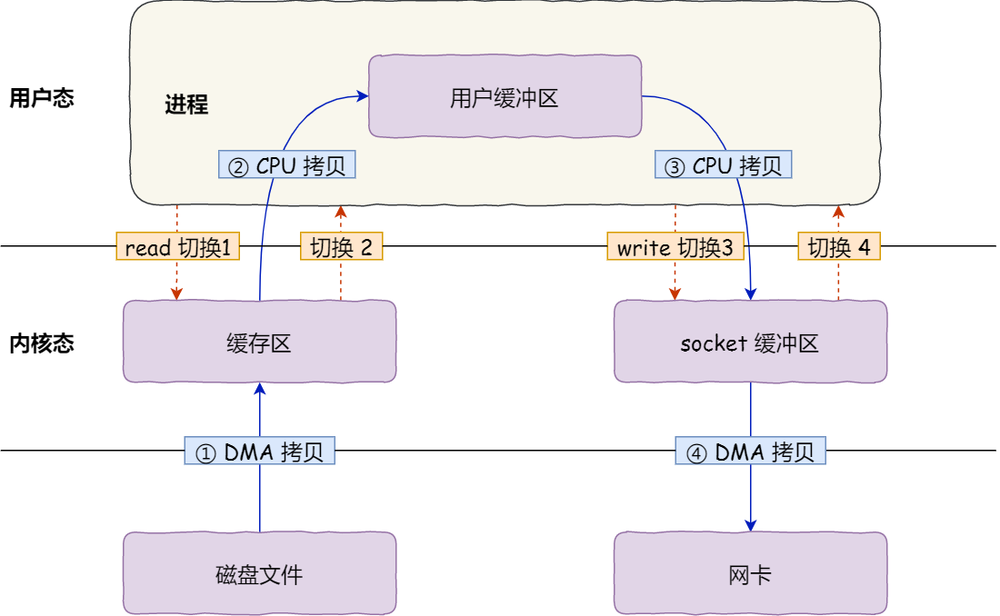
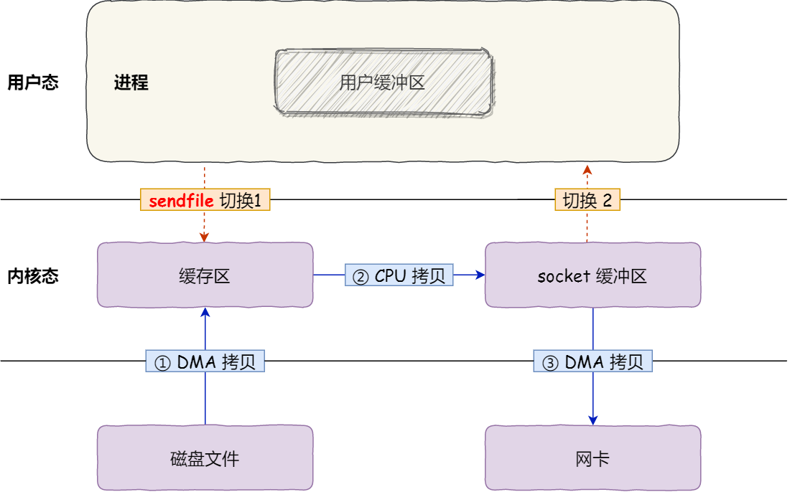

# 零拷贝技术

> 本文来自：[原来 8 张图，就可以搞懂「零拷贝」了_小林coding](https://blog.csdn.net/qq_34827674/article/details/108756999)


## DMA

- DMA：**Direct Memory Access**，直接内存访问
- DMA **主要功能是传输数据**，但是**不需要占用 CPU**，即在传输数据时，CPU 可以做别的事
- 如今由于 I/O 设备越来越多，数据传输的需求也不尽相同，所以每个 **I/O 设备里面都有自己的 DMA 控制器**


## 传统文件传输方式



- 图中 **1 份数据**的 Copy 过程，产生了 **4 次上下切换** 和 **4 次数据 Copy**
- 零拷贝技术 的目的是为 **减少「用户态与内核态的上下文切换」和「内存拷贝」的次数**


## 优化传输的思路

### 减少上下文切换

- 读取磁盘数据的时候，之所以要发生上下文切换，这是**因为用户空间没有权限操作磁盘或网卡**
- 所以，操作设备的过程都**需要交由操作系统内核来完成**，所以一般要通过**使用操作系统提供的系统调用函数**
- 一次**系统调用**必然会发生 2 次上下文切换
  1. 调用的时候，首先从用户态切换到内核态
  2. 当内核执行完任务后，再切换回用户态交由进程代码执行
- 要想减少上下文切换到次数，就要 **减少系统调用的次数**
  

### 减少拷贝次数

- 传统的文件传输方式会历经 4 次数据拷贝
- ~~从内核的读缓冲区拷贝到用户的缓冲区里，再从用户的缓冲区里拷贝到 socket 的缓冲区里~~，这个过程是没有必要的
- **文件传输的应用场景中，在用户空间我们并不会对数据「再加工」**，所以可以不用搬运到用户空间，因此用户的缓冲区是没有必要存在的


## mmap + write


- 使用 `mmap()` 来代替 `read()`， 可以减少一次数据拷贝的过程，**减少了一次 数据 Copy**


### NIO 示例

```java
final Path filePath = FileChannelTool.getResourcePath(MMapMain.class);
// 
final FileChannel fileChannel = FileChannel.open(filePath, READ);
// memory-mapped
final MappedByteBuffer buffer = fileChannel.map(FileChannel.MapMode.READ_ONLY, 0, 1024);
// 
// 通过 UDP 发送出去
final DatagramChannel channel = DatagramChannel.open();
// write
channel.send(buffer, new InetSocketAddress("127.0.0.1", 9999));
```


## sendfile（transferTo）




- 在 Linux 内核版本 2.1 中，提供了一个**专门发送文件的系统调用函数** `sendfile()`
- 可以替代前面的 `read()` 和 `write()` 这两个系统调用，这样就 **可以减少一次系统调用**，也就 **减少了 2 次上下文切换的开销**
- 可以**直接把内核缓冲区里的数据拷贝到 Socket 缓冲区里**，不再拷贝到用户态
- 整个过程 **有 2 次上下文切换**，**3 次数据拷贝**


### NIO 示例

```java
final Path filePath = FileChannelTool.getResourcePath(SendfileMain.class);

//
final FileChannel fileChannel = FileChannel.open(filePath, READ);

//
// 通过 UDP 发送出去
final DatagramChannel channel = DatagramChannel.open();
channel.connect(new InetSocketAddress("127.0.0.1", 9999));

// sendfile
fileChannel.transferTo(0, 1024, channel);
```


## 完全 零拷贝

- `sendfile` 系统调用，**仍然有一次 CPU Copy 过程**，还不是真正的零拷贝技术
- 如果网卡支持 **SG-DMA**（The Scatter-Gather Direct Memory Access）技术，可以进一步**减少 CPU 把内核缓冲区里的数据拷贝到 Socket 缓冲区**的过程

查看网卡是否支持 scatter-gather 特性

```bash
$ ethtool -k eth0 | grep scatter-gather
scatter-gather: on
```


- 这就是所谓的 **零拷贝（Zero-copy）技术**
- 没有在内存层面去拷贝数据，也就是说**全程没有通过 CPU 来搬运数据**，所有的数据 **都是通过 DMA 来进行传输的**
- 需要 **2 次上下文切换**，**2 次数据拷贝**且都不需要通过 CPU，**2 次都是由 DMA 来搬运**

- 零拷贝技术可以把文件传输的性能提高至少一倍以上
  

## Read More

- [DMA（直接储存器访问）](https://blog.csdn.net/zxh1592000/article/details/78678132)